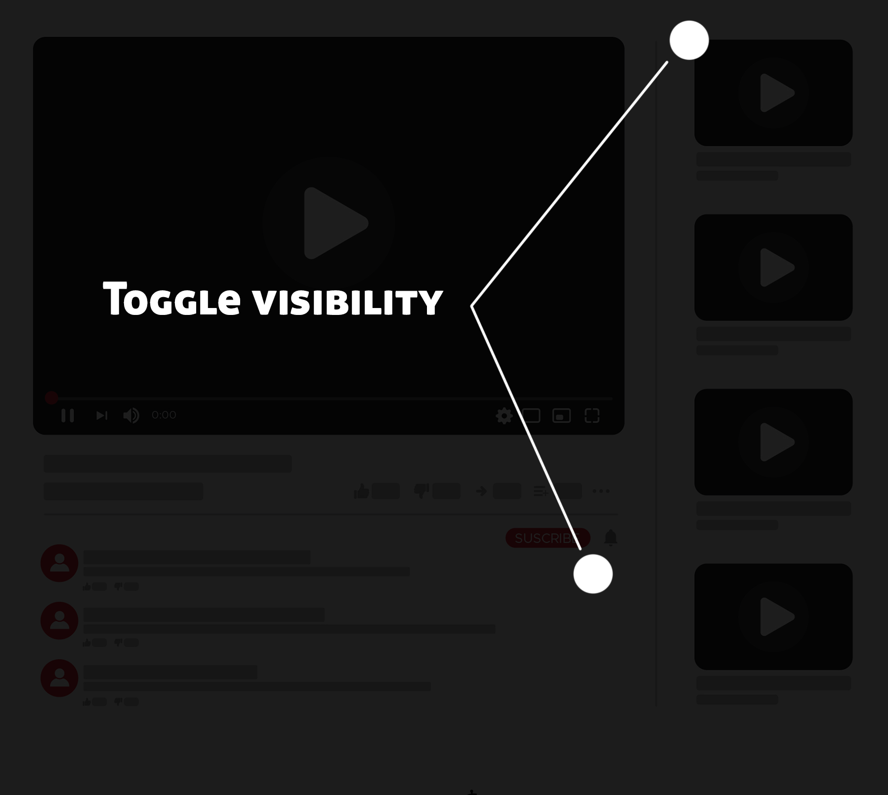

# Distractionless YouTube

A YouTube clone with additional functionality to toggle the visibility of distracting sections like comments and recommended videos.

## Why?

Very often, when I'm watching a youtube video, I find myself distracted either by recommended videos or by comments section.

## Solution

Add "visibility togglers" next to the distracting sections. This way, if you actually want to take a look at the comments section 
to find a link for example, you are still able to that.



## Getting started

### YouTube API

The app uses [YouTube Data API](https://developers.google.com/youtube/v3). Go to [Developers Console](https://console.developers.google.com/)
to get your key.

Once you have a key, create `.env` file in the root directory:
```env
REACT_APP_YOUTUBE_KEY=YOUR-YOUTUBE-API-KEY
```

### Install dependencies
```bash
$ npm install
```

### Run the app
```bash
$ npm run start
```
